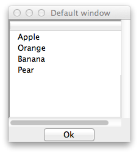
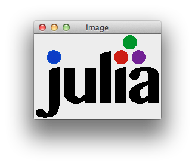

## The Tk Package

This package provides an interface to the Tcl/Tk libraries, useful for
creating graphical user interfaces. The basic functionality is
provided by the `tcl_eval` function, which is used to pass on Tcl
commands. The `Canvas` widget is used to create a device for plotting
of `julia`'s graphics. In particular, among others, the `Winston` and
`Images` package can render to such a device.

The example `sketch.jl` illustrates this widget for a different purpose.


In addition, there are convenience methods for working with most of
the widgets provided by `Tk` similar to the ones found in `R`'s
`tcltk` package.  For example, we add the `tcl` function as a wrapper
for `tcl_eval` which provides translations from `julia` objects into
Tcl constructs.


### Constructors

Constructors are provided  for the following widgets

* `Toplevel`: for top level windows
* `Frame`, `Labelframe`, `Notebook`, `Panedwindow`: for the basic containers
* `Label`, `Button`, `Menu`: basic elements
* `Checkbutton`, `Radio`, `Combobox`, `Slider`, `Spinbox`: selection widgets
* `Entry`, `TkText`: text widgets
* `Treeview`: for trees, but also listboxes and grids
* `Sizegrip`, `Separator`, `Progressbar`, `Image` various widgets

The basic usage simply calls the `ttk::` counterpart, though one can
use named arguments to pass in configuration options. As well, some have a
convenience interfaces.

### Methods

In addition to providing constructors, there are few additional
convenience methods defined.

* The `configure`, `cget`, `tclvar`, `identify`, `state`, `instate`,
  `winfo`, `wm`, `bind` methods to simplify the corresponding Tcl
  commands. For a single option of a widget accessed via `cget` and
  modified via `configure`, one can use the index notation with a
  symbol, as in `widget[:option]` or `widget[:option] = value`.

* For widget layout, we have `pack`, `pack_configure`, `forget`,
  `grid`, `grid_configure`, `grid_forget`, ... providing interfaces to
  the appropriate Tk commands, but also `formlayout` and `page_add`
  for working with simple forms and notebooks and pane windows..

* We add the methods `get_value` and `set_value` to get and set the
  primary value for a control

* We add the methods `get_items` and `set_items` to get and set the
  item(s) to select from for selection widgets.

* We add the methods `width`, `height`, `get_size` to get the
  on-screen size of a widget. For top level windows there are
  `set_width`, `set_height`, and `set_size` for adjusting the
  geometry. The `:width` and `:height` properties are common to most
  widgets, and return the _requested_ width and height, which need not
  be the actual width and height on screen.

* The conveniences `get_enabled` and `set_enabled` to specify if a
  widget accepts user input


## Examples

A simple "Hello world" example, which shows off many of the styles is given by:

```jl
w = Toplevel("Example")                                    ## A titled top level window
f = Frame(w, padding = [3,3,2,2], relief="groove")         ## A Frame with some options set
pack(f, expand = true, fill = "both")                      ## using pack to manage the layout of f
#
b = Button(f, "Click for a message")                       ## Button constructor has convenience interface
grid(b, 1, 1)                                              ## use grid to pack in b. 1,1 specifies location
#
callback(path) = Messagebox(w, title="A message", message="Hello World") ## A callback to open a message
bind(b, "command", callback)                            ## bind callback to 'command' option
bind(b, "<Return>", callback)                           ## press return key when button has focus
```

We see the use of an internal frame to hold the button. The frame's
layout is managed using `pack`, the buttons with `grid`. Both these
have some conveniences. For grid, the location of the cell can be
specified by 1-based index as shown. The button callback is just a
`julia` function. Its first argument, `path`, is used internally. In
this case, we open a modal dialog with the `Messagebox` constructor
when the callback is called. The button object has this callback bound
to the button's `command` option. This responds to a mouse click, but
not a press of the `enter` key when the button has the focus. For
that, we also bind to the `<Return>` event.


For the R package `tctlk` there are numerous examples at
http://bioinf.wehi.edu.au/~wettenhall/RTclTkExamples/ . We borrow a
few of these to illustrate the `Tk` package for `julia`.

`Tk` commands are combined strings followed by options. Something
like: `.button configure -text {button text}` is called as
`configure(button, text = "button text)`. Key-value options are
specified with through named arguments, which are converted to the
underlying Tcl object. Similarly, path names are also translated and
functions are converted to callbacks.


### Pack widgets into a themed widget for better appearance

`Toplevel` is the command to create a new top-level
window. (`Tk.Window` is similar, but we give `Toplevel` a unique type
allowing us to add methods, such as `set_value` to modify the title.)
Toplevel windows play a special role, as they start the widget
hierarchy needed when constructing child components.

A top level window is not a themed widget. Immediately packing in a
`Frame` instance is good practice, as otherwise the background of the
window may show through:

```jl
w = Toplevel()
f = Frame(w)
pack(f, expand=true, fill="both")
```

#### Notes:

* Sometimes the frame is configured with padding so that the sizegrip
  shows, e.g. `frame(w, padding = [3,3,2,2])`.

* The above will get the size from the frame -- which has no
  request. This means the window will disappear. You may want to force
  the size to come from the top level window. You can use `tcl("pack",
  "propagate", w, false)` (wrapped in `pack_stop_propagate`) to get
  this:

```jl
w = Toplevel("title", 400, 300)	## title, width, height
pack_stop_propagate(w)
f = Frame(w)
pack(f, expand=true, fill="both")
```

* resizing top level windows with the mouse can leave visual artifacts, at least on a
  Mac. This is not optimal! (The picture below can be avoided by packing an expanding frame into the top level widget.)

</img>

### Message Box

The `Messagebox` constructor makes a modal message box.

```jl
Messagebox(title="title", message="message")
```

An optional `parent` argument can be specified to locate the box near
the parent, as seen in the examples.

### File Dialogs

File Open, File Save and Choose Directory dialogs can be invoked as follows.

```jl
GetOpenFile()
GetSaveFile()
ChooseDirectory()
```

### Checkbuttons


Check boxes are constructed with `Checkbutton`:

```jl
w = Toplevel()
f = Frame(w)
pack(f, expand=true, fill="both")
cb = Checkbutton(f, "I like Julia")
pack(cb)

function callback(path)		   ## callbacks have at least one argument
  value = get_value(cb)
  msg = value ? "Glad to hear that" : "Sorry to hear that"
  Messagebox(w, title="Thanks for the feedback", message=msg)
end

bind(cb, "command", callback)   ## bind to command option
```

The `set_items` method can be used to change the label.


### Radio buttons


```jl
w = Toplevel()
f = Frame(w)
pack(f, expand=true, fill="both")

l  = Label(f, "Which do you prefer?")
rb = Radio(f, ["apples", "oranges"])
b  = Button(f, "ok")
map(u -> pack(u, anchor="w"), (l, rb, b))     ## pack in left to right


function callback(path)
  msg = (get_value(rb) == "apples") ? "Good choice!  An apple a day keeps the doctor away!" :
                                      "Good choice!  Oranges are full of Vitamin C!"
  Messagebox(w, msg)
end

bind(b, "command", callback)
```

The individual buttons can be accessed via the `buttons` property. This
allows one to edit the labels, as in

```jl
set_items(rb.buttons[1], "Honeycrisp Apples")
```

(The `set_items` method is used to set the items for a selection
widget, in this case the lone item is the name, or label of the
button.)

### Menus

Menu bars for top level windows are easily created with the `menu_add`
method. One can add actions items (pass a callback function), check
buttons, radio buttons, or separators.

```jl
w = Toplevel()
tcl("pack", "propagate", w, false) ## or pack_stop_propagate(w)

mb = Menu(w)			## makes menu, adds to top-level window
fmenu = menu_add(mb, "File")
omenu = menu_add(mb, "Options")

menu_add(fmenu, "Open file...", (path) -> println("Open file dialog, ..."))
menu_add(fmenu, Separator(w))	## second argument is Tk_Separator instance
menu_add(fmenu, "Close window", (path) -> destroy(w))

cb = Checkbutton(w, "Something visible")
set_value(cb, true)		## initialize
menu_add(omenu, cb)		## second argument is Tk_Checkbutton instance

menu_add(omenu, Separator(w))	## put in a separator

rb = Radio(w, ["option 1", "option 2"])
set_value(rb, "option 1")	## initialize
menu_add(omenu, rb)		## second argument is Tk_Radio instance

b = Button(w, "print selected options")
pack(b, expand=true, fill="both")

function callback(path)
  vals = map(get_value, (cb, rb))
  println(vals)
end

callback_add(b, callback)	## generic way to add callback for most common event
)
```


### Entry widget


The entry widget can be used to collect data from the user.

```jl
w = Toplevel()
f = Frame(w); pack(f, expand=true, fill="both")

e = Entry(f)
b = Button(f, "Ok")

formlayout(e, "First name:")
formlayout(b, nothing)
focus(e)			## put keyboard focus on widget

function callback(path)
  val = get_value(e)
  msg = "You have a nice name $val"
  Messagebox(w,  msg)
end

bind(b, "command", callback)
bind(b, "<Return>", callback)
bind(e, "<Return>", callback)  ## bind to a certain key press event
```

### Listboxes



There is no `Listbox` constructor; rather, we replicate this with
`Treeview` simply by passing a vector of strings. Here we use a
scrollbar too:

```jl
fruits = ["Apple", "Navel orange", "Banana", "Pear"]
w = Toplevel("Favorite fruit?")
tcl("pack", "propagate", w, false)
f = Frame(w)
pack(f, expand=true, fill="both")

f1 = Frame(f)			## need internal frame for use with scrollbars
lb = Treeview(f1, fruits)
scrollbars_add(f1, lb)
pack(f1,  expand=true, fill="both")

b = Button(f, "Ok")
pack(b)

bind(b, "command") do path	## do style
         fruit_choice = get_value(lb)
	 msg = (fruit_choice == nothing) ? "What, no choice?" : "Good choice! $(fruit_choice[1])" * "s are delicious!"
	 Messagebox(w,  msg)
end
```

The value returned by `get_value` is an array or `nothing`. Returning
`nothing` may not be the best choice, perhaps a 0-length array is
better?

One can configure the `selectmode`, e.g. `configure(lb,
selectmode = "extended")` with either `extended` (multiple
selection possible, `browse` (single selection), or `none` (no
selection).) The shortcut `lb[:selectmode] = "extended"` will also work.

The `Treeview` widget can also display a matrix of strings in a grid
in addition to tree-like data.

An editable grid could be done, but requires some additional Tk
libraries.

### Combo boxes

Selection from a list of choices can be done with a combo box:


```jl
fruits = ["Apple", "Navel orange", "Banana", "Pear"]

w = Toplevel("Combo boxes", 300, 200)
tcl("pack", "propagate", w, false)
f = Frame(w); pack(f, expand=true, fill="both")

grid(Label(f, "Again, What is your favorite fruit?"), 1, 1)
cb = Combobox(f, fruits)
grid(cb, 2,1, sticky="ew")

b = Button(f, "Ok")
grid(b, 3, 1)

function callback(path)
  fruit_choice = get_value(cb)
  msg = (fruit_choice == nothing) ? "What, no choice?" :
                                    "Good choice! $(fruit_choice)" * "s are delicious!"
  Messagebox(w, msg)
end

bind(b, "command", callback)
```

Here no choice also returns `nothing`. Use this value with `set_value`
to clear the selection, if desired.

Editable combo boxes need to be configured by hand. (So combo isn't
really what we have here :)

### Text windows

The basic multi-line text widget can be done through:

```jl
w = Toplevel()
tcl("pack", "propagate", w, false)
f = Frame(w)
txt = TkText(f)
scrollbars_add(f, txt)
pack(f, expand=true, fill = "both")
```

Only a `get_value` and `set_value` is provided. One can configure
other things (adding/inserting text, using tags, ...) directly with
`tcl` or `tcl_eval`.

### Events

One can bind a callback to an event in Tcl/Tk. There are few things to know:

* Callbacks have at least one argument (we use `path`). With
  `bind`, other arguments are matched by name to correspond to
  Tcl/Tk's percent substitution. E.g. `f(path, x, y)` would get values
  for x and y through `%x %y`.

* We show how to bind to a widget event, but this can be more
  general. E.g., top level events are for all children of the window a
  style can match all object of that style.

* many widgets have a standard `command` argument in addition to
  window manager events they respond to. The value `command` can be passed to
  `bind` as the event.

* The `bind` method does most of the work. The `callback_add`
  method binds to the most common event, mostly the `command`
  one. This can be used to bind the same callback to multiple widgets
  at once.


### Sliders

The `Slider` widget presents a slider for selection from a range of
values. The convenience constructor allows one to specify the range of
values through a `Range` object, or the low and high `float` values of the range.  Note
that `get_value` returns a `float`, even if used with an integer range.

```jl
w = Toplevel()
f = Frame(w)
pack(f, expand=true, fill="both")
pack(Label(f, "Int Range slider"), side="top")
s_range = Slider(f, 1:100)
pack(s_range, side="top", expand=true, fill="both", anchor="w")
bind(s_range, "command", path -> println("The range value is $(int(get_value(s_range)))"))

pack(Label(f, "Float slider"), side="top")
s_float = Slider(f, 0.0, 1.0)
pack(s_float, side="top", expand=true, fill="both", anchor="w")
bind(s_float, "command", path -> println("The float value is $(get_value(s_float))"))
```


One can also call `bind` using the `do` idiom:

```jl
bind(sc, "command") do path
  println("The value is $(get_value(sc))")
end
```


### Sharing a variable between widgets


Some widgets have a `textvariable` option. These can be shared to have
automatic synchronization. For example, the scale widget does not have
any indication as to the value, we remedy this with a label.

```jl
w = Toplevel("Slider and label", 300, 200)
f = Frame(w); pack(f, expand = true, fill = "both")

sc = Slider(f, 1:20)
l = Label(f)
l[:textvariable] = sc[:variable]

grid(sc, 1, 1, sticky="ew")
grid(l,  2, 1, sticky="nw")
grid_columnconfigure(f, 1, weight=1)
```

This combination above is not ideal, as the length of the label is not
fixed. It would be better to format the value and use `set_value` in a
callback.

### Spinbox


The scale widget easily lets one pick a value, but it can be hard to
select a precise one. The spinbox makes this easier. Here we link the
two using a callback:

```jl
w = Toplevel("Slider/Spinbox")
f = Frame(w); pack(f, expand = true, fill = "both")

sc = Slider(f, 1:100)
sp = Spinbox(f, 1:100)
map(pack, (sc, sp))

bind(sc, "command", path -> set_value(sp, get_value(sc)))
bind(sp, "command", path -> set_value(sc, get_value(sp)))
```
### Images



The `Image` widget can be used to show `gif` files.

```jl
fname = Pkg.dir("Tk", "examples", "logo.gif")
img = Image(fname)

w = Toplevel("Image")
f = Frame(w); pack(f, expand = true, fill = "both")
l = Label(f, img)
pack(l)
```

This example adds an image to a button.

```jl
fname = Pkg.dir("Tk", "examples", "weather-overcast.gif") ## https://code.google.com/p/ultimate-gnome/
img = Image(fname)

w = Toplevel("Icon in button")
f = Frame(w); pack(f, expand = true, fill = "both")
b = Button(f, "weather", img)   ## or: b = Button(f, text="weather", image=img, compound="left")
pack(b)
```

### Graphics

The `Canvas` widget can be placed in a GUI to embed a graphics device. In the
examples directory you can find an implementation of RStudio's `manipulate`
function.  This functions makes it very straightforward to define basic
interactive GUIs for plotting with `Winston`.


To try it, run

```jl
require(Pkg.dir("Tk", "examples", "manipulate.jl"))
```

The above graphic was produced with:

```jl
ex = quote
    x = linspace( 0, n * pi, 100 )
    c = cos(x)
    s = sin(x)
    p = FramedPlot()
    setattr(p, "title", title)
    if
        fillbetween add(p, FillBetween(x, c, x, s) )
    end
    add(p, Curve(x, c, "color", color) )
    add(p, Curve(x, s, "color", "blue") )
    file(p, "example1.png")
    p				## return a winston object
end
obj = manipulate(ex,
                 slider("n", "[0, n*pi]", 1:10)
                 ,entry("title", "Title", "title")
                 ,checkbox("fillbetween", "Fill between?", true)
                 ,picker("color", "Cos color", ["red", "green", "yellow"])
                 ,button("update")
                 )
```


### Frames

The basic widget to hold child widgets is the Frame. As seen in the
previous examples, it is simply constructed with `Frame`. The
`padding` option can be used to give some breathing room.

Laying out child components is done with a layout manager, one of
`pack`, `grid`, or `place` in Tk.

#### pack

For `pack` there are several configuration options that are used to
indicate how packing of child components is to be done. The examples
make use of

* `side`: to indicate the side of the cavity that the child should be
  packed against. Typically "top" to top to bottom packing or "left"
  for left to right packing.

* `anchor`: One of the compass points indicating what part of the
  cavity the child should be attached to.

* `expand`: should the child expand when packed

* `fill`: how should an expanding child fill its space. We use
  `{:expand=>true, :fill=>"both"}` to indicate the child should take
  all the available space it can. Use `"x"` to stretch horizontally,
  and `"y"` to stretch vertically.

Unlike other toolkits (Gtk, Qt), one can pack both horizontally and
vertically within a frame. So to pack horizontally, one must add the
`side` option each time. It can be convenient to do this using a map
by first creating the widgets, then managing them:

```jl
w = Toplevel("packing example")
f = Frame(w); pack(f, expand=true, fill="both")
ok_b = Button(f, "Ok")
cancel_b = Button(f, "Cancel")
help_b = Button(f, "Help")
map(u -> pack(u, side = "left"), (ok_b, cancel_b, help_b))
```

#### grid

For `grid`, the arguments are the row and column. We use integers or ranges.
When given a range, the widget can span multiple rows or columns. Within a
cell, the `sticky` argument replaces the `expand`, `fill`, and `anchor`
arguments. This is a string with one or more directions to attach. A value of
`news` is like `Dict(:expand=>true, :fill=>"both")`, as all four sides are
attached to.


```jl
w = Toplevel("Grid")
f = Frame(w, padding = 10); pack(f, expand=true, fill="both")

s1 = Slider(f, 1:10)
s2 = Slider(f, 1:10, orient="vertical")
b3 = Button(f, "ew sticky")
b4 = Button(f, "ns sticky")

grid(s1, 1, 1:2, sticky="news")
grid(s2, 2:3, 2, sticky="news")
grid(b3, 2, 1)
grid(b4, 3, 1,   sticky="ns") ## breaks theme
```

We provide the `formlayout` method for conveniently laying out widgets
in a form-like manner, with a label on the left. (Pass `nothing` to
suppress this.)

One thing to keep in mind: *a container in Tk can only employ one
layout style for its immediate children* That is, you can't manage
children both with `pack` and `grid`, though you can nest frames and
mix and match layout managers.


### Notebooks

A notebook container holds various pages and draws tabs to allow the
user to switch between them. The `page_add` method makes this easy:

```jl
w = Toplevel()
tcl("pack", "propagate", w, false)
nb = Notebook(w)
pack(nb, expand=true, fill="both")

page1 = Frame(nb)
page_add(page1, "Tab 1")
pack(Button(page1, "page 1"))

page2 = Frame(nb)
page_add(page2, "Tab 2")
pack(Label(page2, "Some label"))

set_value(nb, 2)		## position on page 2
```


### Panedwindows

A paned window allows a user to allocate space between child
components using their mouse. This is done by dragging a "sash". As
with `Notebook` containers, children are added through `page_add`.

```jl
w = Toplevel("Panedwindow", 800, 300)
tcl("pack", "propagate", w, false)
f = Frame(w); pack(f, expand=true, fill="both")

pg = Panedwindow(f, "horizontal") ## orientation. Use "vertical" for up down.
grid(pg, 1, 1, sticky = "news")

page_add(Button(pg, "button"))
page_add(Label(pg, "label"))

f = Frame(pg)
formlayout(Entry(f), "Name:")
formlayout(Entry(f), "Rank:")
formlayout(Entry(f), "Serial Number:")
page_add(f)

set_value(pg, 100)                 ## set divider between first two pixels
tcl(pg, "sashpos", 1, 200)	   ## others set the tcl way
```
